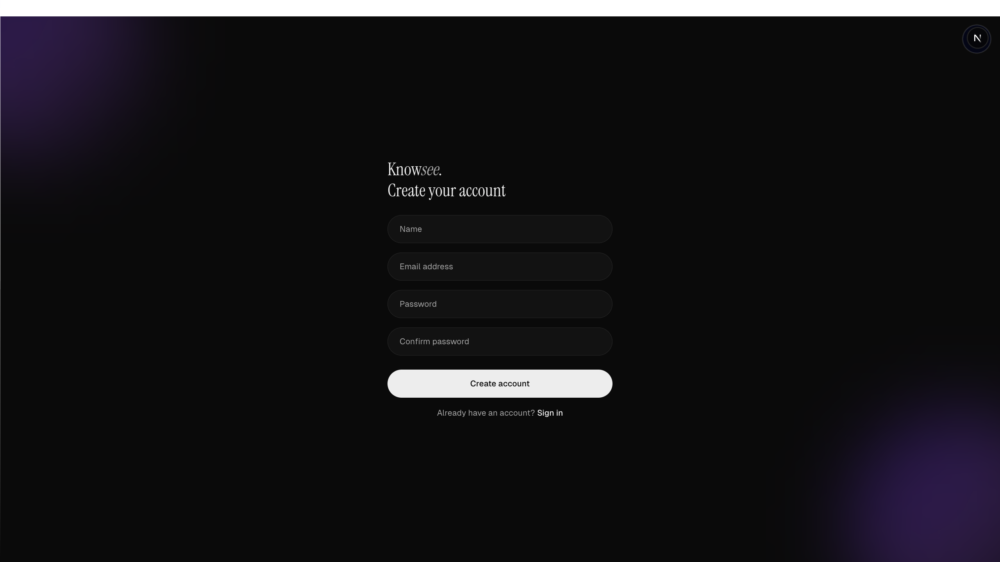
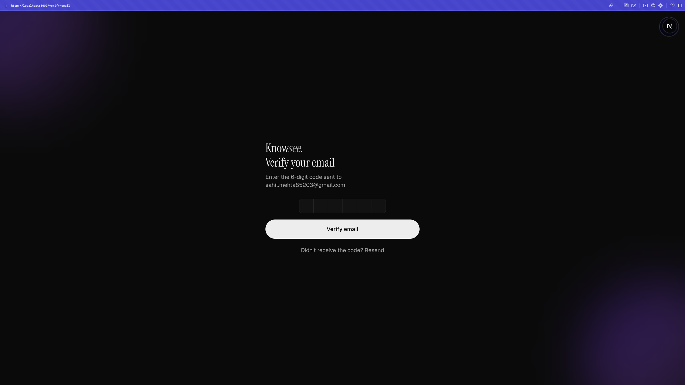
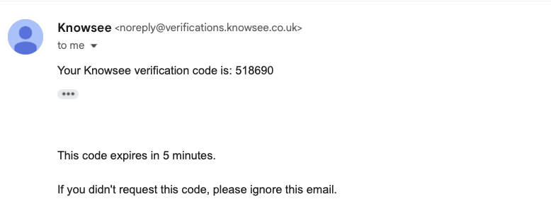
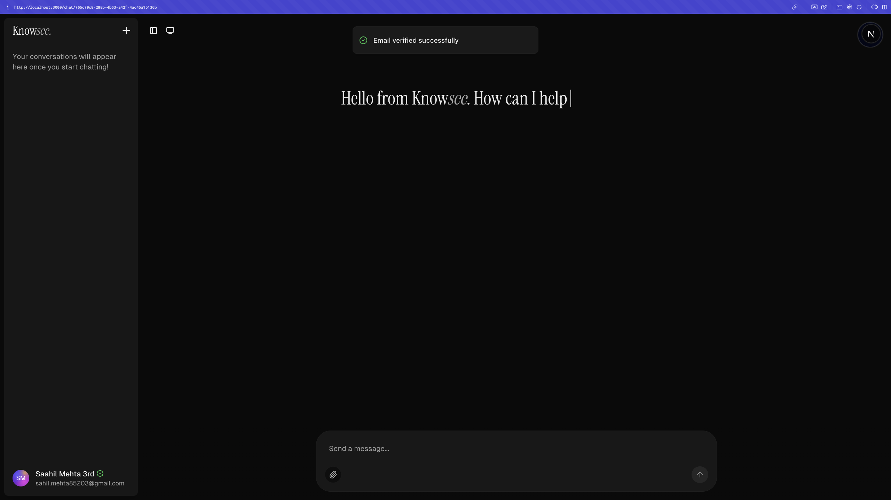
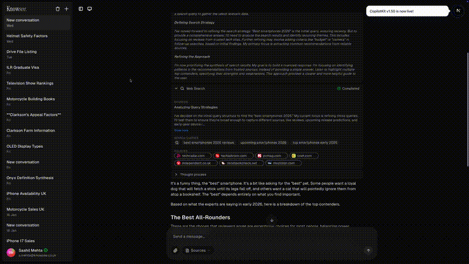
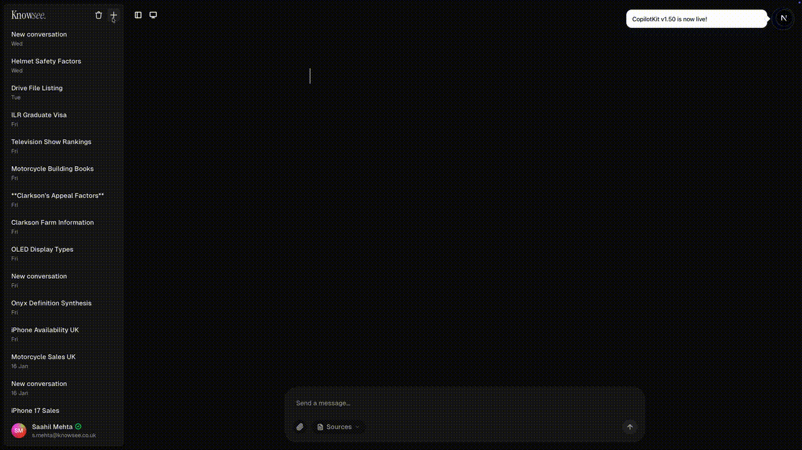
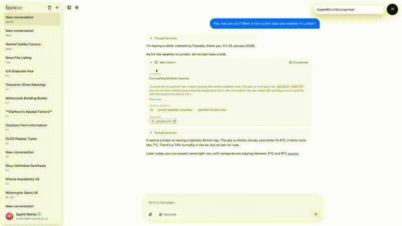
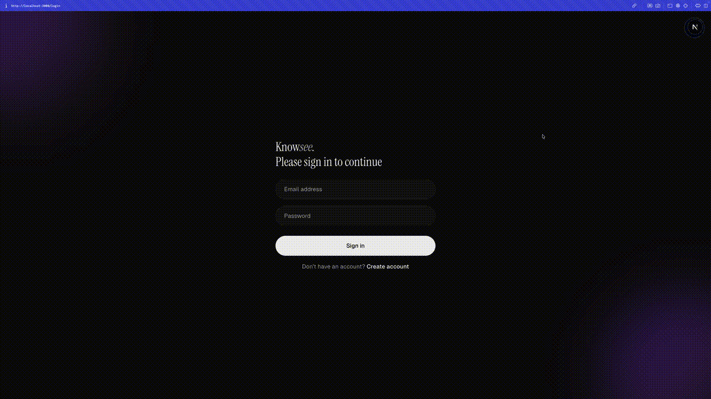

**A fullstack reference implementation for building AI assistants with Google ADK and CopilotKit using AGUI, A2A and GenerativeUI**

---

Knowsee demonstrates how to build a multi-agent conversational AI using [Google Agent Development Kit (ADK)](https://github.com/google/adk-python) for the backend and [CopilotKit](https://copilotkit.ai) for the frontend, connected via the [AG-UI protocol](https://docs.ag-ui.com).

## Features

### 🤖 Agentic Architecture

- **Multi-Agent Orchestration** — Hierarchical delegation via `AgentTool` with isolated contexts
- **A2A Composition** — Agent-to-agent patterns without namespace contamination
- **Extended Thinking** — Gemini 2.5 Pro with dedicated reasoning budget
- **AG-UI Protocol** — Bidirectional streaming between frontend and backend
- **Generative UI** — Tool calls, reasoning, and sources as interactive components
- **SSE Event Bus** — Live updates without polling

### 🔍 Retrieval & Grounding

- **Vertex AI RAG Engine** — Semantic search with team-scoped corpus access
- **Web Search Grounding** — Google Search with inline citations
- **Multi-Source Synthesis** — RAG + web + uploads unified in responses

### 🏗️ Production-Ready

- **Better Auth** — Email/password, OTP verification, TOTP 2FA
- **Pluggable Identity** — Supports Google Groups, Azure AD, custom providers
- **Permission-Scoped RAG** — Users only access corpora their teams own
- **Terraform IaC** — Cloud Run, Cloud SQL, Vertex AI, KMS
- **SOPS Secrets** — Encrypted configuration management
- **Scheduled Sync** — Automated RAG corpus updates from GDrive/OneDrive

## Demo

### 1. Create an Account

Sign up with email and password.

### 2. Verify Your Email

An OTP is sent to your inbox.

 

### 3. Welcome to Knowsee

After verification, you're in.

### 4. Chat with Personality

Ask anything — get up-to-date answers with a touch of humour.

### 5. Sessions & Tools

Conversations persist. Tools like Google Search just work.

### 6. Light Mode

For the light-mode lovers.

### 7. Sign In & Out

Seamless authentication flow.

